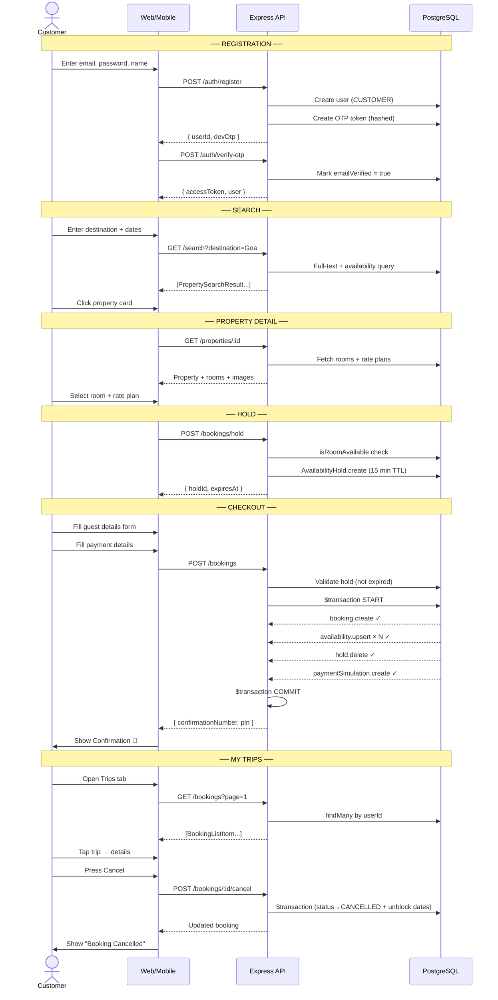
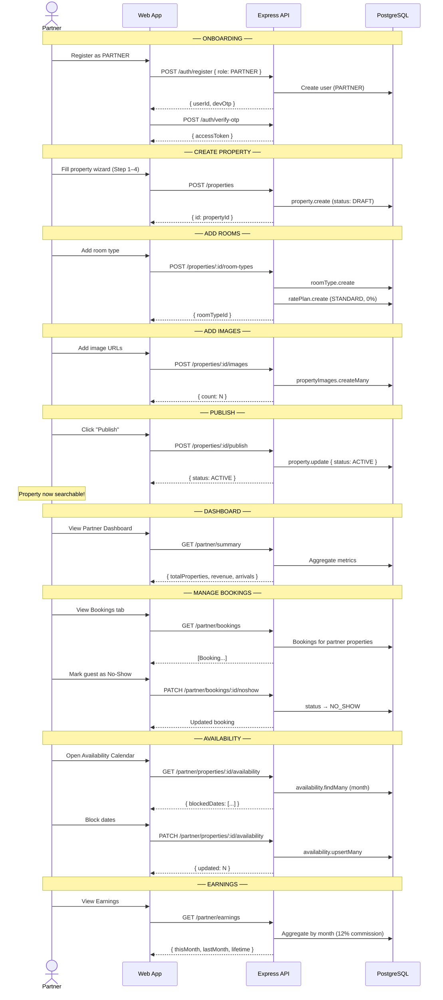

# StayBook Platform — Complete Technical Reference

> **Version** 1.0 · **Status** MVP Complete · **Stack** Express · React · Flutter · PostgreSQL

---

## Table of Contents

1. [Executive Summary](#1-executive-summary)
2. [System Architecture](#2-system-architecture)
3. [Technology Stack](#3-technology-stack)
4. [Database Schema](#4-database-schema)
   - 4.1 [Entity-Relationship Diagram](#41-entity-relationship-diagram)
   - 4.2 [Table Reference with Keys & Relations](#42-table-reference-with-keys--relations)
   - 4.3 [Enums](#43-enums)
   - 4.4 [Indexes & Full-Text Search](#44-indexes--full-text-search)
5. [Backend API Reference](#5-backend-api-reference)
   - 5.1 [Auth](#51-auth--apiv1auth)
   - 5.2 [Users](#52-users--apiv1users)
   - 5.3 [Search](#53-search--apiv1search)
   - 5.4 [Properties](#54-properties--apiv1properties)
   - 5.5 [Bookings](#55-bookings--apiv1bookings)
   - 5.6 [Partner](#56-partner--apiv1partner)
   - 5.7 [Admin](#57-admin--apiv1admin)
   - 5.8 [Error Response Schema](#58-error-response-schema)
6. [Authentication Deep Dive](#6-authentication-deep-dive)
7. [Booking Transaction — Atomic Flow](#7-booking-transaction--atomic-flow)
8. [Sequence Diagrams](#8-sequence-diagrams)
9. [Web Client — React](#9-web-client--react)
10. [Flutter Mobile App](#10-flutter-mobile-app)
11. [Environment Variables](#11-environment-variables)
12. [Setup & Deployment Guide](#12-setup--deployment-guide)
13. [Seed Accounts](#13-seed-accounts)
14. [Phase 2 Roadmap](#14-phase-2-roadmap)

---

## 1. Executive Summary

**StayBook** is a full-stack hotel booking platform modelled after Booking.com, built as a production-quality MVP. It supports three user roles — **Customer**, **Partner** (property owner), and **Admin** — across two client applications sharing a single REST API.

| Dimension | Detail |
|-----------|--------|
| Platform | Web (React) + Mobile (Flutter) |
| Backend | Express.js + Prisma ORM + PostgreSQL |
| Auth | OTP email verification + JWT (access + refresh rotation) |
| Booking | Atomic 4-step transaction with 15-min availability hold |
| Search | PostgreSQL full-text search with `tsvector` + availability filter |
| State | 0 Flutter analyze errors · All customer and partner flows end-to-end |

---

## 2. System Architecture

```
┌───────────────────────────────────────────────────────────────────┐
│                          CLIENT LAYER                             │
│                                                                   │
│   ┌─────────────────────────┐    ┌──────────────────────────┐    │
│   │   React Web App          │    │  Flutter Mobile App      │    │
│   │   (Vite + TailwindCSS)   │    │  (Android + iOS)         │    │
│   │   Customer / Partner /   │    │  Customer only           │    │
│   │   Admin portals          │    │  Clean Architecture      │    │
│   └────────────┬────────────┘    └───────────┬──────────────┘    │
│                │ Axios (JWT Bearer)           │ Dio (JWT Bearer)  │
└────────────────┼─────────────────────────────┼───────────────────┘
                 │                             │
                 ▼                             ▼
┌──────────────────────────────────────────────────────────────────┐
│                       REST API LAYER                             │
│                                                                  │
│   Express.js  ·  Zod Validation  ·  JWT Middleware               │
│   Rate Limiting  ·  Helmet  ·  CORS  ·  Winston Logging         │
│                                                                  │
│   /api/v1/auth      /api/v1/search    /api/v1/properties         │
│   /api/v1/users     /api/v1/bookings  /api/v1/partner            │
│   /api/v1/admin                                                  │
│                                                                  │
│   ┌─────────────────┐   ┌──────────────────────────────────┐    │
│   │  Hold GC Job     │   │  Payment Simulation Engine        │    │
│   │  (every 5 min)   │   │  (Phase 2 → Stripe Connect)       │    │
│   └─────────────────┘   └──────────────────────────────────┘    │
└──────────────────────────────┬───────────────────────────────────┘
                               │ Prisma ORM
                               ▼
┌──────────────────────────────────────────────────────────────────┐
│                       DATA LAYER                                 │
│                                                                  │
│   PostgreSQL 15                                                   │
│   11 tables  ·  10 enums  ·  Full-text search (tsvector)         │
│   GIN indexes on amenities + search_vector                       │
│   Unique constraint on availability(room_type_id, date)          │
└──────────────────────────────────────────────────────────────────┘
```

---

## 3. Technology Stack

### Server

| Category | Technology | Version | Purpose |
|----------|-----------|---------|---------|
| Runtime | Node.js | 20 LTS | JavaScript runtime |
| Framework | Express.js | 4.x | HTTP server |
| ORM | Prisma | 5.x | DB access + migrations |
| Database | PostgreSQL | 15 | Primary data store |
| Validation | Zod | 3.x | Schema validation + DTOs |
| Auth | jsonwebtoken | 9.x | JWT sign/verify |
| Password | bcrypt | 5.x | Password + OTP hashing |
| Logging | Winston | 3.x | Structured logging |
| HTTP logging | Morgan | 1.x | Request logs |
| Rate limiting | express-rate-limit | 7.x | Auth endpoint throttling |
| Security | Helmet | 7.x | HTTP security headers |
| Compression | compression | 1.x | Gzip responses |
| Language | TypeScript | 5.x | Type-safe JavaScript |

### React Web Client

| Category | Technology | Version | Purpose |
|----------|-----------|---------|---------|
| Framework | React | 18.x | UI library |
| Build | Vite | 5.x | Dev server + bundler |
| Styling | TailwindCSS | 3.x | Utility CSS |
| Routing | React Router | 6.x | Client-side navigation |
| State | Zustand | 4.x | Auth + checkout store |
| Data fetching | React Query (TanStack) | 5.x | Server state + caching |
| HTTP | Axios | 1.x | API calls + interceptors |
| Forms | React Hook Form + Zod | 7.x + 3.x | Validation |
| Language | TypeScript | 5.x | Type safety |
| Notifications | react-hot-toast | 2.x | User feedback |

### Flutter Mobile App

| Category | Technology | Version | Purpose |
|----------|-----------|---------|---------|
| SDK | Flutter | 3.x | Cross-platform mobile |
| Language | Dart | 3.x | Null-safe Dart |
| State mgmt | flutter_bloc | 8.x | BLoC + Cubit pattern |
| Equality | equatable | 2.x | Value equality |
| Navigation | go_router | 14.x | Declarative routing |
| HTTP | dio | 5.x | REST calls + interceptors |
| Secure storage | flutter_secure_storage | 9.x | Token persistence |
| DI | get_it | 8.x | Service locator |
| Error handling | dartz | 0.10.x | Either monad |
| Image caching | cached_network_image | 3.x | Async image loading |
| Code gen | json_serializable + freezed | 6.x + 2.x | Model generation |

---

## 4. Database Schema

### 4.1 Entity-Relationship Diagram

```mermaid
erDiagram
    users {
        uuid        id              PK
        string      email           UK
        string      password_hash
        enum        role
        boolean     email_verified
        string      first_name
        string      last_name
        string      refresh_token
        timestamp   created_at
        timestamp   updated_at
        timestamp   deleted_at
    }

    otp_tokens {
        uuid        id              PK
        uuid        user_id         FK
        string      code_hash
        timestamp   expires_at
        boolean     used
        timestamp   created_at
    }

    properties {
        uuid        id              PK
        uuid        owner_id        FK
        string      name
        string      description
        string      address
        string      city
        string      postcode
        float       lat
        float       lng
        enum        category
        string      sub_category
        enum        status
        int         star_rating
        enum        booking_mode
        json        amenities
        tsvector    search_vector
        timestamp   created_at
        timestamp   updated_at
    }

    property_images {
        uuid        id              PK
        uuid        property_id     FK
        string      url
        enum        tag
        int         sort_order
    }

    room_types {
        uuid        id              PK
        uuid        property_id     FK
        string      name
        string      description
        int         max_occupancy
        json        bed_config
        decimal     base_price
        enum        meal_plan
        enum        cancellation_policy
        timestamp   created_at
        timestamp   updated_at
    }

    rate_plans {
        uuid        id              PK
        uuid        room_type_id    FK
        enum        plan_type
        decimal     discount_percent
        int         min_nights
    }

    availability {
        uuid        id              PK
        uuid        property_id     FK
        uuid        room_type_id    FK
        date        date
        boolean     is_blocked
        uuid        booking_id      FK
    }

    availability_holds {
        uuid        id              PK
        uuid        room_type_id    FK
        uuid        property_id     FK
        uuid        user_id         FK
        date        checkin
        date        checkout
        timestamp   expires_at
        timestamp   created_at
    }

    bookings {
        uuid        id              PK
        uuid        user_id         FK
        uuid        property_id     FK
        uuid        room_type_id    FK
        uuid        rate_plan_id    FK
        date        checkin
        date        checkout
        int         adults
        int         children
        decimal     total_price
        enum        status
        string      confirmation_number UK
        string      pin
        string      payment_transaction_id
        decimal     refund_amount
        string      guest_name
        string      guest_email
        string      guest_phone
        string      guest_country
        string      special_requests
        string      arrival_time
        string      cancellation_reason
        timestamp   cancelled_at
        timestamp   created_at
        timestamp   updated_at
    }

    payment_simulations {
        uuid        id              PK
        uuid        booking_id      FK  UK
        string      transaction_id
        string      cardholder_name
        char4       card_last_four
        boolean     simulated_failure
        boolean     success
        string      failure_reason
        timestamp   created_at
    }

    partner_legal {
        uuid        id              PK
        uuid        property_id     FK  UK
        enum        entity_type
        string      first_name
        string      last_name
        date        date_of_birth
        string      pan
        string      aadhaar
        string      gst
        string      phone
        timestamp   created_at
        timestamp   updated_at
    }

    users               ||--o{ otp_tokens          : "has"
    users               ||--o{ properties           : "owns"
    users               ||--o{ bookings             : "makes"
    users               ||--o{ availability_holds   : "holds"
    properties          ||--o{ property_images      : "has"
    properties          ||--o{ room_types           : "contains"
    properties          ||--o{ bookings             : "receives"
    properties          ||--o{ availability         : "tracks"
    properties          ||--o{ availability_holds   : "holds"
    properties          ||--o| partner_legal        : "has KYC"
    room_types          ||--o{ rate_plans           : "has"
    room_types          ||--o{ availability         : "tracks"
    room_types          ||--o{ availability_holds   : "holds"
    room_types          ||--o{ bookings             : "booked via"
    rate_plans          ||--o{ bookings             : "applies to"
    bookings            ||--o{ availability         : "blocks"
    bookings            ||--o| payment_simulations  : "has"
```

---

### 4.2 Table Reference with Keys & Relations

#### `users`
| Column | Type | Key | Notes |
|--------|------|-----|-------|
| `id` | `UUID` | 🔑 **PK** | `uuid()` default |
| `email` | `VARCHAR` | 🔒 **UNIQUE** | Indexed; lowercased on register |
| `password_hash` | `VARCHAR` | | bcrypt 10–12 rounds |
| `role` | `Role` enum | | `CUSTOMER \| PARTNER \| ADMIN` |
| `email_verified` | `BOOLEAN` | | False until OTP verified |
| `first_name` | `VARCHAR?` | | Nullable |
| `last_name` | `VARCHAR?` | | Nullable |
| `refresh_token` | `VARCHAR?` | | Rotated on every refresh |
| `created_at` | `TIMESTAMP` | | Auto |
| `updated_at` | `TIMESTAMP` | | Auto |
| `deleted_at` | `TIMESTAMP?` | | Soft delete |

---

#### `otp_tokens`
| Column | Type | Key | Notes |
|--------|------|-----|-------|
| `id` | `UUID` | 🔑 **PK** | |
| `user_id` | `UUID` | 🔗 **FK** → `users.id` | CASCADE delete |
| `code_hash` | `VARCHAR` | | bcrypt hash of 6-digit code |
| `expires_at` | `TIMESTAMP` | | 10 min after creation |
| `used` | `BOOLEAN` | | Invalidated on first use |
| `created_at` | `TIMESTAMP` | | |

---

#### `properties`
| Column | Type | Key | Notes |
|--------|------|-----|-------|
| `id` | `UUID` | 🔑 **PK** | |
| `owner_id` | `UUID` | 🔗 **FK** → `users.id` | |
| `name` | `VARCHAR` | | |
| `description` | `TEXT?` | | |
| `address` | `VARCHAR` | | |
| `city` | `VARCHAR` | | Indexed; used in search |
| `postcode` | `VARCHAR?` | | |
| `lat` / `lng` | `FLOAT?` | | Geo coordinates |
| `category` | `PropertyCategory` | | `HOTEL\|APARTMENT\|VILLA\|HOSTEL\|OTHER` |
| `sub_category` | `VARCHAR?` | | Free-text sub-type |
| `status` | `PropertyStatus` | | `DRAFT → ACTIVE \| PAUSED` |
| `star_rating` | `INT?` | | 1–5 |
| `booking_mode` | `BookingMode` | | `INSTANT \| REQUEST` |
| `amenities` | `JSON` | | Array of strings; GIN indexed |
| `search_vector` | `tsvector?` | | GIN indexed; updated by PG trigger |
| `created_at` / `updated_at` | `TIMESTAMP` | | Auto |

---

#### `property_images`
| Column | Type | Key | Notes |
|--------|------|-----|-------|
| `id` | `UUID` | 🔑 **PK** | |
| `property_id` | `UUID` | 🔗 **FK** → `properties.id` | CASCADE delete |
| `url` | `VARCHAR` | | Image URL |
| `tag` | `ImageTag` | | `EXTERIOR\|BEDROOM\|BATHROOM\|DINING\|COMMON` |
| `sort_order` | `INT` | | Ascending = cover image |

---

#### `room_types`
| Column | Type | Key | Notes |
|--------|------|-----|-------|
| `id` | `UUID` | 🔑 **PK** | |
| `property_id` | `UUID` | 🔗 **FK** → `properties.id` | CASCADE delete |
| `name` | `VARCHAR` | | e.g. "Deluxe Double" |
| `description` | `TEXT?` | | |
| `max_occupancy` | `INT` | | Adults + children |
| `bed_config` | `JSON` | | `[{type: "double", count: 1}]` |
| `base_price` | `DECIMAL(10,2)` | | Per night, before discount |
| `meal_plan` | `MealPlan` | | `NONE \| BREAKFAST` |
| `cancellation_policy` | `CancellationPolicy` | | `FLEXIBLE \| NON_REFUNDABLE` |
| `created_at` / `updated_at` | `TIMESTAMP` | | Auto |

---

#### `rate_plans`
| Column | Type | Key | Notes |
|--------|------|-----|-------|
| `id` | `UUID` | 🔑 **PK** | |
| `room_type_id` | `UUID` | 🔗 **FK** → `room_types.id` | CASCADE delete |
| `plan_type` | `RatePlanType` | | `STANDARD \| NON_REFUNDABLE \| WEEKLY` |
| `discount_percent` | `DECIMAL(5,2)` | | 0 = STANDARD, 10 = NON_REF, 15 = WEEKLY |
| `min_nights` | `INT` | | 1 = STANDARD/NON_REF, 7 = WEEKLY |

---

#### `availability`
| Column | Type | Key | Notes |
|--------|------|-----|-------|
| `id` | `UUID` | 🔑 **PK** | |
| `property_id` | `UUID` | 🔗 **FK** → `properties.id` | CASCADE delete |
| `room_type_id` | `UUID` | 🔗 **FK** → `room_types.id` | CASCADE delete |
| `date` | `DATE` | 🔒 `UNIQUE(room_type_id, date)` | One row per room-type per day |
| `is_blocked` | `BOOLEAN` | | `true` = unavailable |
| `booking_id` | `UUID?` | 🔗 **FK** → `bookings.id` | Which booking blocked it |

---

#### `availability_holds`
| Column | Type | Key | Notes |
|--------|------|-----|-------|
| `id` | `UUID` | 🔑 **PK** | |
| `room_type_id` | `UUID` | 🔗 **FK** → `room_types.id` | CASCADE delete |
| `property_id` | `UUID` | 🔗 **FK** → `properties.id` | CASCADE delete |
| `user_id` | `UUID` | 🔗 **FK** → `users.id` | CASCADE delete |
| `checkin` / `checkout` | `DATE` | | Hold date range |
| `expires_at` | `TIMESTAMP` | | Indexed; 15 min (prod) / 60 min (dev) |
| `created_at` | `TIMESTAMP` | | |

---

#### `bookings`
| Column | Type | Key | Notes |
|--------|------|-----|-------|
| `id` | `UUID` | 🔑 **PK** | |
| `user_id` | `UUID` | 🔗 **FK** → `users.id` | Indexed |
| `property_id` | `UUID` | 🔗 **FK** → `properties.id` | Indexed |
| `room_type_id` | `UUID` | 🔗 **FK** → `room_types.id` | |
| `rate_plan_id` | `UUID` | 🔗 **FK** → `rate_plans.id` | |
| `checkin` / `checkout` | `DATE` | | Stay range |
| `adults` / `children` | `INT` | | Occupancy |
| `total_price` | `DECIMAL(10,2)` | | nights × base × (1 - discount) |
| `status` | `BookingStatus` | | `CONFIRMED\|CANCELLED\|COMPLETED\|NO_SHOW` |
| `confirmation_number` | `VARCHAR` | 🔒 **UNIQUE** | `BKxxxxxxxxxxxxxxxx` format |
| `pin` | `VARCHAR(4)` | | 4-digit booking PIN |
| `payment_transaction_id` | `VARCHAR?` | | Nullable (REQUEST mode) |
| `refund_amount` | `DECIMAL(10,2)?` | | Post-cancellation |
| `guest_name` / `guest_email` / `guest_phone` / `guest_country` | `VARCHAR` | | Guest contact |
| `special_requests` | `TEXT?` | | |
| `arrival_time` | `VARCHAR?` | | Estimated arrival |
| `cancellation_reason` | `TEXT?` | | |
| `cancelled_at` | `TIMESTAMP?` | | |
| `created_at` / `updated_at` | `TIMESTAMP` | | Auto |

---

#### `payment_simulations`
| Column | Type | Key | Notes |
|--------|------|-----|-------|
| `id` | `UUID` | 🔑 **PK** | |
| `booking_id` | `UUID?` | 🔗 **FK** → `bookings.id` · 🔒 **UNIQUE** | 1:1 with booking |
| `transaction_id` | `VARCHAR` | | `TXN-<uuid>` format |
| `cardholder_name` | `VARCHAR` | | |
| `card_last_four` | `CHAR(4)` | | Last 4 digits only |
| `simulated_failure` | `BOOLEAN` | | Test flag |
| `success` | `BOOLEAN` | | Payment outcome |
| `failure_reason` | `VARCHAR?` | | Populated on failure |
| `created_at` | `TIMESTAMP` | | |

---

#### `partner_legal` *(KYC)*
| Column | Type | Key | Notes |
|--------|------|-----|-------|
| `id` | `UUID` | 🔑 **PK** | |
| `property_id` | `UUID` | 🔗 **FK** → `properties.id` · 🔒 **UNIQUE** | 1:1 with property; CASCADE delete |
| `entity_type` | `EntityType` | | `INDIVIDUAL \| BUSINESS` |
| `first_name` / `last_name` | `VARCHAR` | | Owner name |
| `date_of_birth` | `DATE` | | |
| `pan` | `VARCHAR?` | | India: 10-char alphanumeric |
| `aadhaar` | `VARCHAR?` | | India: 12-digit |
| `gst` | `VARCHAR?` | | India: 15-char GST number |
| `phone` | `VARCHAR` | | |
| `created_at` / `updated_at` | `TIMESTAMP` | | Auto |

---

### 4.3 Enums

| Enum | Values |
|------|--------|
| `Role` | `CUSTOMER` · `PARTNER` · `ADMIN` |
| `PropertyStatus` | `ACTIVE` · `DRAFT` · `PAUSED` |
| `PropertyCategory` | `HOTEL` · `APARTMENT` · `VILLA` · `HOSTEL` · `OTHER` |
| `BookingMode` | `INSTANT` · `REQUEST` |
| `BookingStatus` | `CONFIRMED` · `CANCELLED` · `COMPLETED` · `NO_SHOW` |
| `RatePlanType` | `STANDARD` · `NON_REFUNDABLE` · `WEEKLY` |
| `MealPlan` | `NONE` · `BREAKFAST` |
| `CancellationPolicy` | `FLEXIBLE` · `NON_REFUNDABLE` |
| `ImageTag` | `EXTERIOR` · `BEDROOM` · `BATHROOM` · `DINING` · `COMMON` |
| `EntityType` | `INDIVIDUAL` · `BUSINESS` |

---

### 4.4 Indexes & Full-Text Search

| Table | Index | Type | Purpose |
|-------|-------|------|---------|
| `users` | `email` | B-tree | Login lookup |
| `properties` | `(city, status)` | B-tree | Search filter |
| `properties` | `search_vector` | **GIN** | Full-text search |
| `properties` | `amenities` | **GIN** | JSON containment |
| `availability` | `(room_type_id, date)` | B-tree UNIQUE | Conflict prevention |
| `availability` | `(property_id, date)` | B-tree | Partner calendar |
| `availability_holds` | `expires_at` | B-tree | GC job sweep |
| `bookings` | `(user_id, status)` | B-tree | My trips |
| `bookings` | `property_id` | B-tree | Partner bookings |
| `otp_tokens` | `user_id` | B-tree | OTP lookup |

**Full-text search trigger** (PostgreSQL)
```sql
CREATE TRIGGER tsvector_update
BEFORE INSERT OR UPDATE ON properties
FOR EACH ROW EXECUTE FUNCTION
  tsvector_update_trigger(search_vector, 'pg_catalog.english', name, city, address, description);
```
The `search_vector` is updated automatically on every `INSERT` or `UPDATE` to `properties`.

---

## 5. Backend API Reference

**Base URL:** `http://localhost:3001/api/v1`  
**Auth header:** `Authorization: Bearer <accessToken>`

### Standard Success Response
```json
{ "statusCode": 200, "data": { ... }, "message": "Success" }
```

### Standard Paginated Response
```json
{
  "statusCode": 200,
  "data": [...],
  "meta": { "total": 100, "page": 1, "limit": 20, "totalPages": 5 }
}
```

---

### 5.1 Auth — `/api/v1/auth`

> Rate-limited: 5 req/min (production) · 100 req/min (development)

#### `POST /register`
Create account and send OTP email.

**Request body**
```json
{
  "email": "user@example.com",
  "password": "secret123",
  "firstName": "John",
  "lastName": "Doe",
  "role": "CUSTOMER"
}
```
> `role` accepts `CUSTOMER` or `PARTNER` only. `ADMIN` is not self-registerable.

**Response `201`**
```json
{
  "statusCode": 201,
  "data": {
    "userId": "uuid",
    "devOtp": "483921"
  },
  "message": "Registration successful. Check your email for OTP."
}
```
> `devOtp` only present in `NODE_ENV=development`.

---

#### `POST /verify-otp`
Verify email OTP and receive access token.

**Request body**
```json
{ "userId": "uuid", "code": "483921" }
```

**Response `200`**
```json
{
  "statusCode": 200,
  "data": {
    "accessToken": "eyJ...",
    "user": { "id": "uuid", "email": "...", "role": "CUSTOMER", ... }
  }
}
```

---

#### `POST /login`
Login with email + password.

**Request body**
```json
{ "email": "user@example.com", "password": "secret123" }
```

**Response `200`**
```json
{
  "statusCode": 200,
  "data": {
    "accessToken": "eyJ...",
    "refreshToken": "eyJ...",
    "user": { "id": "uuid", "email": "...", "role": "CUSTOMER", ... }
  }
}
```

---

#### `POST /refresh`
Rotate access + refresh tokens.

**Request body**
```json
{ "refreshToken": "eyJ..." }
```

**Response `200`**
```json
{
  "data": { "accessToken": "eyJ...", "refreshToken": "eyJ..." }
}
```

---

#### `POST /logout`
🔒 Requires auth. Clears stored refresh token.

**Response `200`** — `{ "message": "Logged out" }`

---

### 5.2 Users — `/api/v1/users`

#### `GET /:id`
🔒 Requires auth. Fetch user profile.

#### `PATCH /:id`
🔒 Requires auth. Update profile.

**Request body**
```json
{ "firstName": "Jane", "lastName": "Smith" }
```

#### `DELETE /:id`
🔒 Requires `ADMIN`. Soft-deletes the user (sets `deleted_at`).

---

### 5.3 Search — `/api/v1/search`

#### `GET /`
Search available properties.

| Query param | Type | Required | Notes |
|-------------|------|----------|-------|
| `destination` | string | ✅ | City name or keyword |
| `checkin` | `YYYY-MM-DD` | ✅ | |
| `checkout` | `YYYY-MM-DD` | ✅ | |
| `adults` | number | ✅ | min 1 |
| `children` | number | | default 0 |
| `rooms` | number | | default 1 |
| `category` | `PropertyCategory` | | Filter by type |
| `page` | number | | default 1 |
| `limit` | number | | default 20, max 50 |

**Response** — paginated list of `PropertySearchResult` with `min_price` and `cover_image`.

---

#### `GET /suggestions`
Autocomplete city suggestions.

| Query param | Type | Notes |
|-------------|------|-------|
| `q` | string | Prefix match on `city` |

**Response** — `{ "data": ["Mumbai", "Delhi", ...] }`

---

#### `GET /destinations`
Featured destination city counts.

**Response** — `{ "data": [{ "city": "Goa", "count": 12 }, ...] }`

---

### 5.4 Properties — `/api/v1/properties`

#### `GET /featured`
Top 8 active properties sorted by star rating. No auth.

#### `GET /:id`
Full property detail — rooms, rate plans, images. No auth.

**Response shape**
```json
{
  "data": {
    "id": "uuid",
    "name": "Grand Hyatt Goa",
    "city": "Goa",
    "starRating": 5,
    "amenities": ["WiFi", "Pool", "Parking"],
    "roomTypes": [
      {
        "id": "uuid",
        "name": "Deluxe Sea View",
        "basePrice": "5000.00",
        "maxOccupancy": 2,
        "bedConfig": [{ "type": "king", "count": 1 }],
        "mealPlan": "BREAKFAST",
        "ratePlans": [
          { "id": "uuid", "planType": "STANDARD", "discountPercent": "0" }
        ]
      }
    ],
    "images": [{ "url": "https://...", "tag": "EXTERIOR" }]
  }
}
```

---

#### `POST /`
🔒 `PARTNER` or `ADMIN`. Create a property (status: `DRAFT`).

**Request body**
```json
{
  "name": "Kabra Apartments",
  "address": "12 MG Road",
  "city": "Bangalore",
  "category": "APARTMENT",
  "starRating": 3,
  "bookingMode": "INSTANT",
  "amenities": ["WiFi", "AC", "Kitchen"]
}
```

#### `PATCH /:id`
🔒 `PARTNER` or `ADMIN`. Update listing. Ownership verified.

#### `POST /:id/publish`
🔒 `PARTNER` or `ADMIN`. Transition `DRAFT → ACTIVE`.

#### `POST /:id/room-types`
🔒 `PARTNER` or `ADMIN`. Add a room type. Auto-creates a `STANDARD` rate plan.

**Request body**
```json
{
  "name": "Superior Room",
  "maxOccupancy": 2,
  "bedConfig": [{ "type": "double", "count": 1 }],
  "basePrice": 2500,
  "mealPlan": "NONE",
  "cancellationPolicy": "FLEXIBLE"
}
```

#### `POST /:id/images`
🔒 `PARTNER` or `ADMIN`. Add images (bulk).

**Request body**
```json
{
  "images": [
    { "url": "https://cdn.example.com/room.jpg", "tag": "BEDROOM", "sortOrder": 1 }
  ]
}
```

---

### 5.5 Bookings — `/api/v1/bookings`

#### `POST /hold`
🔒 `CUSTOMER`. Reserve a slot for 15 minutes.

**Request body**
```json
{
  "roomTypeId": "uuid",
  "propertyId": "uuid",
  "checkin": "2025-12-01",
  "checkout": "2025-12-05",
  "adults": 2,
  "children": 0
}
```

**Response `201`**
```json
{
  "data": {
    "id": "uuid",
    "expiresAt": "2025-11-20T12:15:00Z"
  }
}
```

---

#### `POST /`
🔒 `CUSTOMER`. Confirm booking from hold. Atomic 4-step transaction.

**Request body**
```json
{
  "holdId": "uuid",
  "ratePlanId": "uuid",
  "adults": 2,
  "children": 0,
  "guestDetails": {
    "firstName": "Rahul",
    "lastName": "Sharma",
    "email": "rahul@example.com",
    "phone": "9876543210",
    "country": "India",
    "specialRequests": "Late check-in please",
    "arrivalTime": "22:00"
  },
  "payment": {
    "cardholderName": "Rahul Sharma",
    "cardNumber": "4111111111111111",
    "expiry": "12/27",
    "cvc": "123"
  }
}
```

**Response `201`**
```json
{
  "data": {
    "id": "uuid",
    "confirmationNumber": "BKM3X7K9ABC",
    "pin": "4821",
    "status": "CONFIRMED",
    "totalPrice": "15000.00",
    "checkin": "2025-12-01",
    "checkout": "2025-12-05"
  }
}
```

---

#### `GET /`
🔒 `CUSTOMER`. Paginated list of own bookings.

| Query param | Default |
|-------------|---------|
| `page` | 1 |
| `limit` | 20 (max 50) |

---

#### `POST /:id/cancel`
🔒 `CUSTOMER`. Cancel a `CONFIRMED` booking. Unblocks availability dates.

---

### 5.6 Partner — `/api/v1/partner`

> All routes require `PARTNER` or `ADMIN` role.

| Method | Path | Description |
|--------|------|-------------|
| `GET` | `/summary` | Dashboard stats: properties, active bookings, revenue, arrivals |
| `GET` | `/properties` | All properties owned by authenticated user |
| `GET` | `/arrivals` | Bookings with check-in in next 7 days |
| `GET` | `/bookings` | Paginated bookings for partner's properties. Query: `status`, `page`, `limit` |
| `PATCH` | `/bookings/:id/noshow` | Mark booking as `NO_SHOW` (ownership verified) |
| `GET` | `/earnings` | This month / last month / lifetime earnings (12% commission applied) |
| `GET` | `/properties/:propertyId/availability` | Monthly availability grid. Query: `year`, `month` |
| `PATCH` | `/properties/:propertyId/availability` | Block or unblock dates. Body: `{ dates: [{ date, roomTypeId, isBlocked }] }` |

**`GET /summary` response**
```json
{
  "data": {
    "totalProperties": 3,
    "activeBookings": 8,
    "monthlyRevenue": "48500.00",
    "upcomingArrivals": 2
  }
}
```

**`GET /earnings` response**
```json
{
  "data": {
    "thisMonth": "48500.00",
    "lastMonth": "62300.00",
    "lifetime": "312700.00",
    "commissionRate": 0.12
  }
}
```

---

### 5.7 Admin — `/api/v1/admin`

> All routes require `ADMIN` role.

| Method | Path | Description |
|--------|------|-------------|
| `GET` | `/stats` | Platform stats + last 5 bookings |
| `GET` | `/users` | Paginated users. Query: `role`, `page`, `limit` |
| `GET` | `/properties` | Paginated properties. Query: `status`, `page`, `limit` |
| `GET` | `/bookings` | Paginated bookings. Query: `status`, `page`, `limit` |
| `PATCH` | `/properties/:id/status` | Change property status (`ACTIVE/DRAFT/PAUSED`) |

---

### 5.8 Error Response Schema

```json
{
  "statusCode": 404,
  "error": {
    "code": "NOT_FOUND",
    "message": "Property not found"
  },
  "timestamp": "2025-11-20T12:00:00Z",
  "path": "/api/v1/properties/bad-uuid"
}
```

| `code` | HTTP Status | Description |
|--------|------------|-------------|
| `EMAIL_IN_USE` | 409 | Email already registered |
| `OTP_INVALID` | 400 | OTP not found or expired |
| `OTP_WRONG` | 400 | Incorrect OTP code |
| `EMAIL_NOT_VERIFIED` | 403 | Email not verified |
| `INVALID_CREDENTIALS` | 401 | Wrong email or password |
| `TOKEN_INVALID` | 401 | Bad or expired JWT |
| `UNAUTHORIZED` | 401 | No token provided |
| `FORBIDDEN` | 403 | Insufficient role |
| `NOT_FOUND` | 404 | Resource not found |
| `ROOM_NOT_AVAILABLE` | 409 | Dates already blocked |
| `HOLD_EXPIRED` | 410 | Hold TTL exceeded |
| `PAYMENT_DECLINED` | 402 | Payment simulation failed |
| `BOOKING_NOT_CANCELLABLE` | 409 | Non-CONFIRMED status |
| `VALIDATION_ERROR` | 400 | Zod schema failure |

---

## 6. Authentication Deep Dive

### Registration + OTP Flow

```
Client                     Server                    DB
  │─── POST /auth/register ──▶│                        │
  │    { email, password,     │─── findUnique(email) ──▶│
  │      firstName, role }    │◀── null ───────────────│
  │                           │─── user.create ─────────▶│
  │                           │─── otpToken.create ─────▶│  (bcrypt hash)
  │                           │─── sendOtpEmail() ──────▶│  (logs in dev)
  │◀── { userId, devOtp } ───│                        │
  │                           │
  │─── POST /auth/verify-otp ─▶│
  │    { userId, code }       │─── findFirst(userId) ──▶│
  │                           │─── bcrypt.compare() ────│
  │                           │─── $transaction ────────▶│  (verify + mark used)
  │◀── { accessToken, user } │                        │
```

### JWT Lifecycle

| Token | Algorithm | Expiry | Stored (React) | Stored (Flutter) |
|-------|-----------|--------|---------------|-----------------|
| Access token | `HS256` | `1h` | Zustand (memory) | `flutter_secure_storage` |
| Refresh token | `HS256` | `7d` | Zustand + `localStorage` | `flutter_secure_storage` |

**Access token payload**
```json
{ "id": "uuid", "email": "user@example.com", "role": "CUSTOMER", "iat": 1700000000, "exp": 1700003600 }
```

**Refresh rotation**
Every call to `POST /auth/refresh` generates a **new** pair — both access and refresh tokens are replaced. The old refresh token is immediately invalidated in the DB. One concurrent logout per user at any time.

### Token Refresh Chain

**React (Axios interceptor)**
```
Request → 401 → retry flag set → POST /auth/refresh → new tokens stored →
original request retried → success (or redirect to /login on refresh failure)
```

**Flutter (Dio interceptor)**
```
Request → 401 → read refresh from SecureStorage → POST /auth/refresh →
write new tokens to SecureStorage → retry original request →
(on refresh failure: deleteAll() tokens → user lands on /login)
```

---

## 7. Booking Transaction — Atomic Flow

When a customer confirms a booking, the server runs a **single Prisma `$transaction`** that either succeeds completely or rolls back entirely:

```
Step 1: booking.create
        ↓
Step 2: availability.upsert × N (one row per night in checkin..checkout range)
        → isBlocked: true, bookingId: booking.id
        ↓
Step 3: availabilityHold.delete (holdId)
        ↓
Step 4: paymentSimulation.create
        ↓ commit or rollback all 4
```

**Pre-transaction checks (service layer)**

```
1. findHoldById(holdId)              → 404 if missing
2. hold.userId === req.user.id       → 403 if mismatch
3. hold.expiresAt < now              → 410 HOLD_EXPIRED
4. isRoomAvailable(roomTypeId, ...)  → 409 ROOM_NOT_AVAILABLE (double-check)
5. resolve ratePlan                  → auto-backfill STANDARD if missing
6. calculate totalPrice              → nights × basePrice × (1 - discount)
7. simulatePayment(card)             → 402 PAYMENT_DECLINED on failure
8. generate confirmationNumber       → BK + Date.now().toString(36) + 3 random bytes
9. generate 4-digit PIN
```

**Availability Hold TTL**

| Environment | TTL |
|-------------|-----|
| `production` | **15 minutes** |
| `development` | 60 minutes |

The GC job runs every **5 minutes** via `setInterval` and calls:
```sql
DELETE FROM availability_holds WHERE expires_at < NOW();
```

---

## 8. Sequence Diagrams

> Both diagrams shown below. Read Customer (left) top-to-bottom, then Partner (right) — their timelines overlap as bookings flow between the two roles.

<table>
<tr>
<th width="50%">Customer Flow</th>
<th width="50%">Partner Flow</th>
</tr>
<tr>
<td valign="top">



</td>
<td valign="top">



</td>
</tr>
</table>

---

## 9. Web Client — React

### Route Map

| Path | Component | Auth | Role | Description |
|------|-----------|------|------|-------------|
| `/` | `SearchPage` | — | Any | Homepage; redirects PARTNER → `/partner/dashboard`, ADMIN → `/admin/dashboard` |
| `/login` | `LoginPage` | — | Any | Email + password login |
| `/register` | `RegisterPage` | — | Any | Register (CUSTOMER or PARTNER) |
| `/verify-otp` | `OtpPage` | — | Any | 6-digit OTP verify |
| `/property/:id` | `PropertyDetailPage` | — | Any | Rooms, images, book CTA |
| `/checkout/details` | `GuestDetailsPage` | ✅ | CUSTOMER | Guest info form |
| `/checkout/payment` | `PaymentPage` | ✅ | CUSTOMER | Card payment |
| `/booking/confirmation/:bookingId` | `ConfirmationPage` | ✅ | CUSTOMER | Booking success + confetti |
| `/trips` | `TripsPage` | ✅ | CUSTOMER | All trips (Active/Past/Cancelled tabs) |
| `/trips/:bookingId` | `TripDetailPage` | ✅ | CUSTOMER | Full booking details + cancel |
| `/partner/dashboard` | `PartnerDashboardPage` | ✅ | PARTNER | Stats overview |
| `/partner/onboarding` | `PartnerOnboardingPage` | ✅ | PARTNER | 4-step property wizard |
| `/partner/bookings` | `PartnerBookingsPage` | ✅ | PARTNER | Booking management |
| `/partner/properties/:id/availability` | `PartnerAvailabilityPage` | ✅ | PARTNER | Calendar grid |
| `/partner/properties/:id/edit` | `PartnerPropertyEditPage` | ✅ | PARTNER | Edit listing |
| `/partner/earnings` | `PartnerEarningsPage` | ✅ | PARTNER | Revenue breakdown |
| `/admin/dashboard` | `AdminDashboardPage` | ✅ | ADMIN | Platform stats |
| `/admin/users` | `AdminUsersPage` | ✅ | ADMIN | User management |
| `/admin/properties` | `AdminPropertiesPage` | ✅ | ADMIN | Property management |
| `/admin/bookings` | `AdminBookingsPage` | ✅ | ADMIN | Booking management |

### State Management — Zustand Stores

**`useAuthStore`** — persisted to `localStorage`

| Field / Action | Type | Description |
|----------------|------|-------------|
| `user` | `User \| null` | Current user object |
| `accessToken` | `string \| null` | JWT access token |
| `refreshToken` | `string \| null` | JWT refresh token |
| `login(user, at, rt)` | action | Set all three on login |
| `setTokens(at, rt)` | action | Refresh rotation |
| `setUser(user)` | action | Profile update |
| `clear()` | action | Logout |
| `isAuthenticated()` | computed | `accessToken !== null` |

**`useCheckoutStore`** — in-memory (not persisted)

| Field / Action | Type | Description |
|----------------|------|-------------|
| `roomSelection` | `RoomSelection \| null` | Property, room, dates, holdId |
| `guestDetails` | `GuestDetails \| null` | Form values from step 1 |
| `setRoomSelection(s)` | action | Set from property detail |
| `setHoldId(id)` | action | After hold API call |
| `setGuestDetails(d)` | action | After guest form submit |
| `clear()` | action | After confirmation |

### Axios Interceptor Chain

```
Request →
  [request interceptor] inject Bearer token from useAuthStore.getState().accessToken
  → send
  ← 401 response
  [response interceptor, _retry=false]
    → POST /auth/refresh { refreshToken }
    → setTokens(newAccessToken, newRefreshToken)
    → retry original request with new token
  ← 401 again (refresh also failed)
    → clear() Zustand store
    → window.location.href = '/login'
```

---

## 10. Flutter Mobile App

### Clean Architecture Layers

```
┌─────────────────────────────────────────────────────────┐
│                    PRESENTATION                          │
│   Pages (UI) ──▶ BLoC/Cubit (events/state) ──▶ Widgets │
│   go_router · flutter_bloc · equatable                  │
└──────────────────────┬──────────────────────────────────┘
                       │ calls use cases only
┌──────────────────────▼──────────────────────────────────┐
│                     DOMAIN  (pure Dart)                  │
│   Entities  ·  Abstract Repositories  ·  Use Cases       │
│   Returns Either<Failure, T> from dartz                  │
└──────────────────────┬──────────────────────────────────┘
                       │ implements contracts
┌──────────────────────▼──────────────────────────────────┐
│                     DATA                                 │
│   Models (json_serializable)  ·  RemoteDataSources (Dio) │
│   RepositoryImpl  ·  AuthInterceptor + token refresh      │
│   flutter_secure_storage for all tokens                  │
└─────────────────────────────────────────────────────────┘
```

**Key rule:** Domain layer imports **nothing** from Flutter, Dio, or data. Presentation depends only on Domain. Data depends on Domain + Dio.

### Feature Modules

| Feature | BLoC/Cubit | Events | States |
|---------|-----------|--------|--------|
| `auth` | `AuthBloc` | `GetCachedUser`, `LoginRequested`, `RegisterRequested`, `VerifyOtpRequested`, `LogoutRequested` | `AuthInitial`, `AuthLoading`, `AuthAuthenticated`, `AuthUnauthenticated`, `AuthError` |
| `search` | `SearchBloc` | `SearchInitialised`, `SearchRequested`, `SuggestionsRequested` | `SearchInitial`, `SearchLoading`, `SearchLoaded`, `SearchError` |
| `property` | `PropertyCubit` | — | `PropertyInitial`, `PropertyLoading`, `PropertyLoaded`, `PropertyError` |
| `checkout` | `CheckoutCubit` | — | `CheckoutInitial`, `HoldCreated`, `BookingConfirmed`, `CheckoutError` |
| `trips` | `TripsBloc` | `LoadTrips`, `CancelBooking` | `TripsInitial`, `TripsLoading`, `TripsLoaded`, `TripsError` |

### Route Map

| Named Route | Path | Page | Auth Guard |
|-------------|------|------|-----------|
| `splash` | `/splash` | `SplashPage` | No |
| `login` | `/login` | `LoginPage` | No |
| `register` | `/register` | `RegisterPage` | No |
| `verifyOtp` | `/verify-otp` | `OtpPage` | No |
| `home` | `/home` | `HomePage` | ✅ |
| `profile` | `/profile` | `ProfilePage` | No |
| `propertyDetail` | `/property/:id` | `PropertyDetailPage` | No |
| `guestDetails` | `/checkout/details` | `GuestDetailsPage` | ✅ |
| `payment` | `/checkout/payment` | `PaymentPage` | ✅ |
| `confirmation` | `/booking/confirmation` | `ConfirmationPage` | ✅ |
| `trips` | `/trips` | `TripsPage` | ✅ |
| `tripDetail` | `/trips/detail` | `TripDetailPage` | ✅ |

Auth guard in `GoRouter.redirect` callback:
```dart
final protectedPaths = ['/home', '/checkout', '/booking', '/trips'];
if (isProtected && !isAuthenticated) return '/login';
```

### Dependency Injection (get_it)

| Registration | Type | Reason |
|--------------|------|--------|
| `FlutterSecureStorage` | `LazySingleton` | One storage instance app-wide |
| `DioClient` | `LazySingleton` | One HTTP client with interceptors |
| `*RemoteDataSource` | `LazySingleton` | Stateless network layer |
| `*Repository` | `LazySingleton` | Stateless data access |
| `*UseCase` | `LazySingleton` | Stateless business logic |
| `AuthBloc` | `LazySingleton` | Lives for full app lifetime |
| `SearchBloc`, `TripsBloc`, `CheckoutCubit`, `PropertyCubit` | **`Factory`** | New instance per screen |

### Token Storage

| Token | Storage key | Method |
|-------|-------------|--------|
| Access token | `access_token` | `flutter_secure_storage.write/read` |
| Refresh token | `refresh_token` | `flutter_secure_storage.write/read` |

On logout or refresh failure: `storage.deleteAll()` clears both.

### Special Patterns

| Pattern | Location | Purpose |
|---------|----------|---------|
| `_KeyboardDismissObserver` | `app_router.dart` | Auto-dismiss keyboard on every route change |
| `_StreamChangeNotifier` | `app_router.dart` | Bridges `AuthBloc.stream` → `GoRouter.refreshListenable` |
| `canPop()` guard | `SplashPage`, `OtpPage` | Prevents back-navigation into splash/OTP |
| Pull-to-refresh | `HomePage` | Dispatches `SearchInitialised` to reload |
| Indian phone validation | `RegisterPage` | Regex `[6-9]\d{9}` (10 digits, starts 6–9) |
| Confetti animation | `ConfirmationPage` | Animated checkmark + confetti on booking success |

---

## 11. Environment Variables

### Server — `server/.env`

| Variable | Required | Default | Description |
|----------|----------|---------|-------------|
| `NODE_ENV` | ✅ | `development` | `development \| production \| test` |
| `PORT` | | `3001` | HTTP listen port |
| `CLIENT_URL` | ✅ | | React app URL for CORS (`http://localhost:3000`) |
| `DATABASE_URL` | ✅ | | Full Prisma connection string |
| `JWT_SECRET` | ✅ | | Min 20 chars (use 32+ in prod) |
| `JWT_EXPIRATION` | | `1h` | Access token lifetime |
| `JWT_REFRESH_SECRET` | ✅ | | Min 20 chars (different from JWT_SECRET) |
| `AWS_REGION` | | | Phase 2: S3 + SES region |
| `AWS_ACCESS_KEY_ID` | | | Phase 2 |
| `AWS_SECRET_ACCESS_KEY` | | | Phase 2 |
| `AWS_S3_BUCKET` | | | Phase 2: image uploads |
| `AWS_SQS_QUEUE_URL` | | | Phase 2: email queue |

### React Client — `client/.env`

| Variable | Required | Default | Description |
|----------|----------|---------|-------------|
| `VITE_API_URL` | ✅ | | Server base URL (`http://localhost:3001`) |
| `VITE_GEMINI_API_KEY` | | | ChatBot API key (**⚠️ move to server in Phase 2**) |

### Flutter — `flutter/lib/core/constants/app_constants.dart`

| Constant | Value (Android emulator) | Value (iOS simulator) |
|----------|--------------------------|----------------------|
| `kBaseUrl` | `http://10.0.2.2:3001/api/v1` | `http://localhost:3001/api/v1` |
| `kAccessTokenKey` | `access_token` | — |
| `kRefreshTokenKey` | `refresh_token` | — |

---

## 12. Setup & Deployment Guide

### Prerequisites

| Tool | Version | Install |
|------|---------|---------|
| Node.js | 20 LTS | [nodejs.org](https://nodejs.org) |
| pnpm | 8+ | `npm i -g pnpm` |
| PostgreSQL | 15+ | Local or Docker |
| Flutter SDK | 3.x | [flutter.dev](https://flutter.dev) |
| Android Studio / Xcode | Latest | For emulator |

### 1. Clone & Install

```bash
git clone <repo>
cd Booking-Ecommerce-System
pnpm install          # installs all workspaces
```

### 2. Database Setup

```bash
# Create PostgreSQL database
createdb staybook_dev

# Copy env file
cp server/.env.example server/.env
# Edit server/.env and set DATABASE_URL, JWT_SECRET, JWT_REFRESH_SECRET, CLIENT_URL

# Run migrations
cd server
npx prisma migrate dev

# Seed with sample data
npx ts-node prisma/seed.ts
```

### 3. Start Server

```bash
cd server
npm run start:dev     # nodemon watch mode on port 3001
```

Verify: `curl http://localhost:3001/health`

### 4. Start React Client

```bash
cp client/.env.example client/.env
# Set VITE_API_URL=http://localhost:3001

cd client
npm run dev           # Vite dev server on port 3000
```

### 5. Start Flutter App

```bash
cd flutter
flutter pub get
flutter pub run build_runner build --delete-conflicting-outputs
flutter run           # connects to 10.0.2.2:3001 on Android emulator
```

### Key npm Scripts

| Location | Command | Description |
|----------|---------|-------------|
| `server/` | `npm run start:dev` | Development with hot reload |
| `server/` | `npm run build` | Compile TypeScript |
| `server/` | `npm run lint` | ESLint check |
| `server/` | `npx prisma studio` | DB GUI at port 5555 |
| `client/` | `npm run dev` | Vite dev server |
| `client/` | `npm run build` | Production bundle |
| `client/` | `npm run lint` | ESLint check |
| `flutter/` | `flutter run` | Run on connected device |
| `flutter/` | `flutter analyze` | Static analysis |
| `flutter/` | `flutter test` | Unit tests |

---

## 13. Seed Accounts

After running `npx ts-node prisma/seed.ts`:

| Role | Email | Password | Notes |
|------|-------|----------|-------|
| `ADMIN` | `admin@staybook.com` | `Admin@123` | Full platform access |
| `PARTNER` | `partner@staybook.com` | `Partner@123` | 2 sample properties seeded |
| `CUSTOMER` | `customer@staybook.com` | `Customer@123` | 1 sample booking seeded |

> All seed users have `emailVerified = true`. No OTP required for seed accounts.

**Sample seeded data:**
- 5 properties across Goa, Mumbai, Delhi (HOTEL + APARTMENT mix)
- 10+ room types with STANDARD rate plans
- Availability blocked for random past dates
- 3 sample bookings (CONFIRMED + CANCELLED)

---

## 14. Phase 2 Roadmap

### Stub Modules (server — files exist, not yet mounted)

| Module | Path | Planned Feature |
|--------|------|----------------|
| `payments` | `server/src/modules/payments/` | Stripe Connect payout integration |
| `notifications` | `server/src/modules/notifications/` | Real-time push + in-app notifications |
| `orders` | `server/src/modules/orders/` | Order management for non-hotel products |
| `services` | `server/src/modules/services/` | Add-on services (taxi, car rental, flight) |

### Feature Backlog

| Priority | Feature | Component | Notes |
|----------|---------|-----------|-------|
| 🔴 High | Real email delivery | Server | Replace `console.log` in `email.util.ts` with Nodemailer/Resend. Add `AWS_SES` or `RESEND_API_KEY` env var |
| 🔴 High | ChatBot proxy | Server + Client | Move `VITE_GEMINI_API_KEY` → `server/.env`; add `POST /api/v1/ai/chat` proxy endpoint |
| 🔴 High | OTP + PIN with `crypto.randomInt` | Server | Replace `Math.random()` in `auth.service.ts:24` and `bookings.service.ts:92` |
| 🟡 Medium | S3 image upload | Server | Replace URL-only `POST /properties/:id/images` with multipart upload to S3 using `@aws-sdk/client-s3` + presigned URLs |
| 🟡 Medium | Search filter params | Server + Client | Add `minPrice`, `maxPrice`, `stars` to `search.schema.ts` and `search.repository.ts` SQL |
| 🟡 Medium | Partner KYC API | Server + Client | `GET/POST /partner/properties/:id/legal` using existing `partner_legal` Prisma model |
| 🟡 Medium | Rate plan management | Server + Client | `POST /properties/:id/room-types/:rtId/rate-plans` for NON_REFUNDABLE and WEEKLY plans |
| 🟡 Medium | Public availability endpoint | Server + Client | `GET /properties/:id/availability` (no auth) for blocked-date display on property detail |
| 🟡 Medium | REQUEST booking mode | Server | Detect `bookingMode=REQUEST` and create booking as awaiting-approval |
| 🟢 Low | WebSocket / Socket.IO | Server | Real-time booking notifications for partner dashboard |
| 🟢 Low | Redis caching | Server | Cache search results + featured properties |
| 🟢 Low | Stripe Connect | Server | Replace `simulatePayment()` with real Stripe integration + partner payout flow |
| 🟢 Low | Token security hardening | Client | Move `accessToken` to memory-only; `refreshToken` to HttpOnly cookie |
| 🟢 Low | Admin panel expansion | React | CSV export, bulk operations, property audit log |
| 🟢 Low | Partner mobile app | Flutter | Add PARTNER role screens to Flutter app |

---

*Generated by StayBook Engineering · Last updated May 2026*
